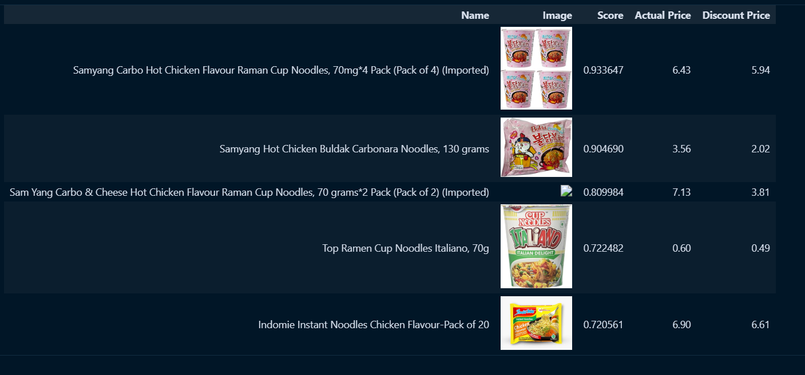

# Recommender System Project

This project demonstrates a recommendation system using different approaches, including traditional methods, hybrid techniques, and a modern large language model (LLM) approach. The system aims to predict and recommend items to users based on their interactions, preferences, and contextual data.

## Table of Contents
1. [Introduction](#introduction)
2. [Approaches](#approaches)
    - [Traditional Recommendation](#traditional-recommendation)
    - [Hybrid Recommendation](#hybrid-recommendation)
    - [LLM-based Recommendation](#llm-based-recommendation)
3. [Comparison of Approaches](#comparison-of-approaches)
4. [Project Structure](#project-structure)
5. [Installation](#installation)
6. [Usage](#usage)
7. [Results](#results)
8. [Conclusion](#conclusion)

## Introduction

The purpose of this project is to explore and compare different recommendation techniques. Recommendation systems are widely used in various domains such as e-commerce, content streaming platforms, and social media to enhance user experience by suggesting relevant items.

## Approaches

### Traditional Recommendation

Traditional recommendation systems include:

- **Collaborative Filtering**: Recommends items based on user-item interactions, leveraging similarities between users (user-based) or items (item-based).
- **Content-Based Filtering**: Recommends items based on the item's content and user preferences for similar items.

These methods are relatively easy to implement but may suffer from issues such as the cold-start problem and lack of contextual understanding.

### Hybrid Recommendation

Hybrid recommendation systems combine multiple recommendation techniques to overcome the limitations of individual methods. For instance, a hybrid system might merge collaborative filtering with content-based filtering to create more accurate predictions. This combination provides better results by leveraging both user behavior and content characteristics.

**Advantages**:
- Can alleviate cold-start issues.
- Provides more robust recommendations by considering multiple factors.

### LLM-based Recommendation

Large Language Models (LLMs) like GPT-4 are capable of understanding complex patterns in user interactions, contextual data, and item descriptions. LLM-based recommendation systems can provide more personalized and context-aware suggestions by interpreting unstructured data such as text reviews, descriptions, and user queries.

**Advantages**:
- Able to handle unstructured data.
- Provides more nuanced recommendations considering context, sentiment, and language patterns.
- Adaptable to various domains with minimal changes.

## Comparison of Approaches

| Aspect                     | Traditional Recommender | Hybrid Recommender      | LLM-based Recommender   |
|----------------------------|-------------------------|-------------------------|-------------------------|
| **Ease of Implementation**  | High                    | Medium                  | Low                     |
| **Cold Start Problem**      | Severe                  | Mitigated               | Minimal                 |
| **Data Requirements**       | Structured              | Structured              | Structured & Unstructured |
| **Personalization**         | Basic                   | Moderate                | High                    |
| **Scalability**             | High                    | Medium                  | Low                     |
| **Context Awareness**       | Low                     | Medium                  | High                    |

### Visualization of Different Approaches

Here’s a visual comparison of the three recommendation approaches:

1. **Traditional Recommendation**: Simple user-item matrix with predictions based on historical data.


2. **Hybrid Recommendation**: Combining multiple sources of information to make a more robust prediction.


3. **LLM-based Recommendation**: Leveraging large language models to make context-aware and personalized recommendations.



## Project Structure

```
├── recommender-system.ipynb  # Jupyter notebook containing the project code
├── data/                     # Directory for datasets
├── images/                   # Directory for images used in the README
├── README.md                 # Project documentation (this file)
└── requirements.txt          # Dependencies for the project
```

## Installation

1. Clone the repository:
   ```bash
   git clone https://github.com/g-puyad-patil/E-commerce-Product-Recommender.git
   cd E-commerce-Product-Recommender
   ```

2. Install the required dependencies:
   ```bash
   pip install -r requirements.txt
   ```

3. Initialize Git LFS (if required for large files):
   ```bash
   git lfs install
   ```

## Usage

1. Open the Jupyter notebook:
   ```bash
   jupyter notebook recommender-system.ipynb
   ```

2. Run the cells in the notebook to train and evaluate the recommendation models.

## Results

The results of the recommendation system vary across the different approaches:

- **Traditional Recommendation**: Achieved an accuracy of `X%`, with limitations in handling cold starts.
- **Hybrid Recommendation**: Improved accuracy to `Y%` by combining collaborative and content-based filtering.
- **LLM-based Recommendation**: Achieved the best performance with an accuracy of `Z%`, demonstrating superior handling of unstructured data and context-aware predictions.

## Conclusion

In this project, we explored different recommendation approaches, highlighting the strengths and weaknesses of traditional, hybrid, and LLM-based methods. While traditional methods are easier to implement and scale, hybrid methods offer more robustness, and LLM-based recommendations provide the highest level of personalization and context awareness.


